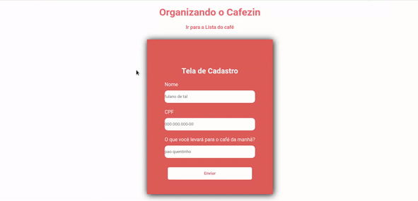
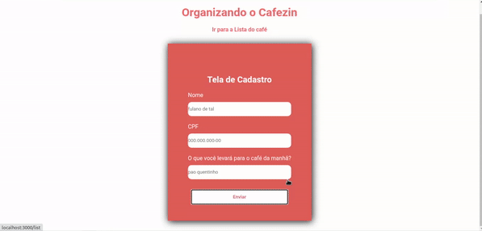
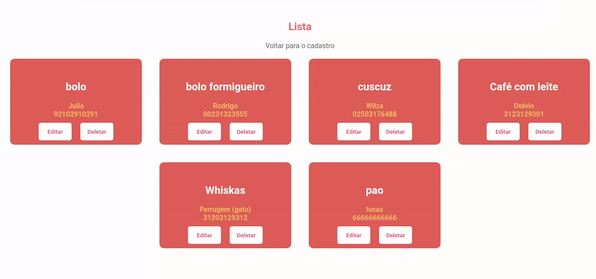

# crud-breakfast

CRUD feito com ReactJS e Node.js.

Projeto já é autexplicável pelo significado de CRUD (Create, Read, Update e Delete). Então é possível criar, ler, atualizar e deletar cadastros. 

Esses cadastros fornecem o nome do cadastrado, seu cpf e o tipo de alimento que escolheu levar para o café da manhã organizado para o grupo. No backend, é verificado se há alimentos e cpf's duplicados, caso seja um duplicado a aplicação não permite o novo cadastro.

### Tecnologias & Libs utilizadas no projeto

BackEnd | FrontEnd
--------- | --------- 
Node.js | ReactJs
Express | Axios
Nodemon | React-router-dom
Mysql | React-spinners
Cors | Styled-components
Http-status-codes |

## Aplicação

Alguns imagens do projeto

